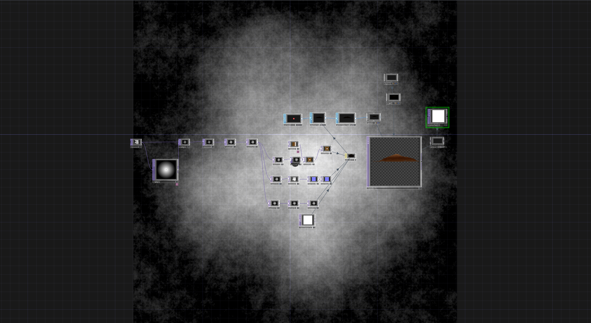

<strong>ELABORATI ESAME "Linguaggi multimediali" - D.Riboli AABB Urbino AA2020/21</strong>
   
<b>TDN_TUTORIAL_01 (Obligatory)</b>
  
Title:<a href="https://www.youtube.com/watch?v=hbZjgHSCAPI&amp;ab_channel=bileamtschepe"> Particle Displacement</a>
 
Created by: bileam tschepe
 
<a href="https://github.com/daniele-ph/AABB.Urbino.daniele.lisi/files/6384006/TD_tutorial_01_screen-video.zip">Download (screen-video) 
  

--------
</a><b>TDN_TUTORIAL_02 (Obligatory)</b>
  
Title: <a href="https://www.youtube.com/watch?v=Kxng628ejFY&ab_channel=NotoTheTalkingBallHow">to make landscape in Touchdesigner</a>
 Created by: Noto The Talking Ball
 
<a href="https://github.com/daniele-ph/Elaborato.esame.daniele.lisi/files/6077874/Dl_tutorial_02.toe.zip">Download (my tutorial version)</a>
 
<a href="https://github.com/daniele-ph/AABB.Urbino.daniele.lisi/files/6384022/TD_tutorial_02_screen-video.zip">Download (screen-video)</a>
  

--------
<b>TDN_TUTORIAL_03 (Modified)</b>
  
Title:<a href="https://www.youtube.com/watch?v=rYet0SwTYa0&ab_channel=bileamtschepe"> 16 – Instancing – TouchDesigner Beginner Course</a>
  
 Created by: bileam tschepe 
   
<b>My changes</b>
- Bg color "Blue" (transform1) 
- Radius of the spheres (sphere1) 
- Decreased the speed of the composition (noise2) 
- Light inclination
 
<a href="https://github.com/daniele-ph/AABB.Urbino.daniele.lisi/files/6391929/Dl_tutorial_03.2.toe.zip">Download (my tutorial version)</a>
 
<a href="https://github.com/daniele-ph/AABB.Urbino.daniele.lisi/files/6392182/TD_tutorial_03_screen-video.zip">Download (screen-video)</a>
  

--------
</a><b>TDN_TUTORIAL_04 (Modified)</b>
  
Title: <a href="https://www.youtube.com/watch?v=lg6hNhQOtIA&ab_channel=NotoTheTalkingBall">Infinite Looping Torus</a>
 
Created by: Noto The Talking Ball 
  
<b>My changes:</b>
 
Download (my tutorial version)
 
Download (screen-video)
  

--------
</a><b>TDN_TUTORIAL_05 (Modified)</b>
 
Title: <a href="https://www.youtube.com/watch?v=AO7mqjLj8n4&ab_channel=bileamtschepe">Tiny Landscape – TouchDesigner Tutorial 12</a>
 
Created by: bileam tschepe
  
<b>My changes:</b>
 
Download (my tutorial version)
 
Download (screen-video)
  

--------
<b>TDN_TUTORIAL_06</b>
 
Title: <a href="https://www.youtube.com/watch?v=dCWUiyBYeho&ab_channel=bileamtschepe">Image Instancing – TouchDesigner Tutorial 26</a>
 
Created by: bileam tschepe
  
<b>My changes:</b>
 
Download (my tutorial version)
 
Download (screen-video)
  

--------
<b>TDN_TUTORIAL_07</b>
 
Title: <a href="https://www.youtube.com/watch?v=SJZIMGg-thY&ab_channel=NotoTheTalkingBall">Instancing Geometry with Mouse interactive in Touchdesigner (터치디자이너 튜토리얼 자막)</a>
 
Created by: Noto The Talking Ball
  
<b>My changes:</b>
 
Download (my tutorial version)
 
Download (screen-video)
  

--------
<b>TDN_TUTORIAL_08</b>
 
Title: <a href="https://www.youtube.com/watch?v=pEp6XiAf8cA&ab_channel=bileamtschepe">Magic Spheres (Height Maps) – TouchDesigner Tutorial 13</a>
 
Created by: bileam tschepe
  
<b>My changes:</b>
 
Download (my tutorial version)
 
Download (screen-video)
  

