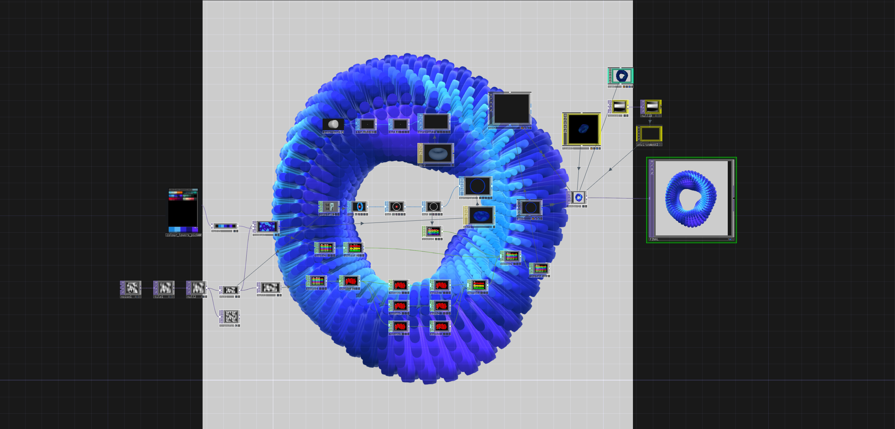

<strong>ELABORATI ESAME "Linguaggi multimediali" - D.Riboli AABB Urbino AA2020/21</strong>  

<b>TD-Network_Tutorial_01 (Obligatory)</b>  Title: Particle Displacement  Created by: bileam tschepe
https://www.youtube.com/watch?v=hbZjgHSCAPI&amp;ab_channel=bileamtschepe</string> 
Download link (my tutorial version) ->[DL_tutorial_01.toe.zip](https://github.com/daniele-ph/Elaborato.esame.daniele.lisi/files/6077889/DL_tutorial_01.toe.zip)
 
Download link (screen-video) -> [TD_tutorial_01_screen-video.zip](https://github.com/daniele-ph/AABB.Urbino.daniele.lisi/files/6384006/TD_tutorial_01_screen-video.zip)
  
  
  

<b>TD-Network_tutorial_02 (Obligatory)</b>  Title: Pow to make landscape in Touchdesigner  Created by: Noto The Talking Ball
https://www.youtube.com/watch?v=Kxng628ejFY&ab_channel=NotoTheTalkingBall 
Download link (my tutorial version) -> [Dl_tutorial_02.toe.zip](https://github.com/daniele-ph/Elaborato.esame.daniele.lisi/files/6077874/Dl_tutorial_02.toe.zip)
 
Download link (screen-video) -> [TD_tutorial_02_screen-video.zip](https://github.com/daniele-ph/AABB.Urbino.daniele.lisi/files/6384022/TD_tutorial_02_screen-video.zip)
  
  
  

<b>TD-Network_tutorial_03</b> 
Title: 16 – Instancing – TouchDesigner Beginner Course 
Created by: bileam tschepe https://www.youtube.com/watch?v=rYet0SwTYa0&ab_channel=bileamtschepe 
Download link (my tutorial version) -> [Dl_tutorial_03.toe.zip](https://github.com/daniele-ph/AABB.Urbino.daniele.lisi/files/6236286/Dl_tutorial_03.toe.zip)
 
Download link (screen-video) -> [TD_tutorial_03_screen-video.zip](https://github.com/daniele-ph/AABB.Urbino.daniele.lisi/files/6384031/TD_tutorial_03_screen-video.zip)
  

  

<b>TD-Network_tutorial_04</b> 
Title: Infinite Looping Torus 
Created by: Noto The Talking Ball https://www.youtube.com/watch?v=lg6hNhQOtIA&ab_channel=NotoTheTalkingBall 
Download link (my tutorial version) ->  [Dl_tutorial_04.toe.zip](https://github.com/daniele-ph/AABB.Urbino.daniele.lisi/files/6236291/Dl_tutorial_04.toe.zip)
 
Download link (screen-video) -> [TD_tutorial_04_screen-video.zip](https://github.com/daniele-ph/AABB.Urbino.daniele.lisi/files/6384032/TD_tutorial_04_screen-video.zip)
  
  
  

<b>TD-Network_tutorial_05 (Modified)</b> 
Title: Tiny Landscape – TouchDesigner Tutorial 12 
Created by: bileam tschepe https://www.youtube.com/watch?v=AO7mqjLj8n4&ab_channel=bileamtschepe 
My changes: I changed the stump of the tree and the colors of the eviroments.
Download link (my tutorial version) -> [tutorial_05.2.toe.zip](https://github.com/daniele-ph/AABB.Urbino.daniele.lisi/files/6236294/tutorial_05.2.toe.zip)
 
Download link (screen-video) -> [TD_tutorial_05_screen-video.zip](https://github.com/daniele-ph/AABB.Urbino.daniele.lisi/files/6384037/TD_tutorial_05_screen-video.zip)
  

  

<b>TD-Network_tutorial_06</b> 
Title: Image Instancing – TouchDesigner Tutorial 26 
Created by: bileam tschepe https://www.youtube.com/watch?v=dCWUiyBYeho&ab_channel=bileamtschepe 
Download link (my tutorial version) -> [tutorial_06.toe.zip](https://github.com/daniele-ph/AABB.Urbino.daniele.lisi/files/6272899/tutorial_06.toe.zip)
 
Download link (screen-video) -> [TD_tutorial_06_screen-video.zip](https://github.com/daniele-ph/AABB.Urbino.daniele.lisi/files/6384039/TD_tutorial_06_screen-video.zip)
  

  
<b>TD-Network_tutorial_07</b> 
Title: Instancing Geometry with Mouse interactive in Touchdesigner (터치디자이너 튜토리얼 자막) 
Created by: Noto The Talking Ball https://www.youtube.com/watch?v=SJZIMGg-thY&ab_channel=NotoTheTalkingBall 
Download link (my tutorial version) -> [tutorial_07.14.toe.zip](https://github.com/daniele-ph/AABB.Urbino.daniele.lisi/files/6325659/tutorial_07.14.toe.zip)
 
Download link (screen-video) -> [TD_tutorial_07_screen-video.zip](https://github.com/daniele-ph/AABB.Urbino.daniele.lisi/files/6384042/TD_tutorial_07_screen-video.zip)
  

  
<b>TD-Network_tutorial_08 (Modified)</b> 
Title: Magic Spheres (Height Maps) – TouchDesigner Tutorial 13 
Created by: bileam tschepe https://www.youtube.com/watch?v=pEp6XiAf8cA&ab_channel=bileamtschepe 
My changes: I added my Hight map about Mount S.Helen and I entered a "Lava texture".
Download link (my tutorial version) -> [TD_tutorial_08.zip](https://github.com/daniele-ph/AABB.Urbino.daniele.lisi/files/6383819/TD_tutorial_08.zip)
 
Download link (screen-video) -> [TD_tutorial_08_screen-video.zip](https://github.com/daniele-ph/AABB.Urbino.daniele.lisi/files/6384049/TD_tutorial_08_screen-video.zip)
 
Download link (material files) -> Mount S.Helen Hightmap [heightmapper-s-helen_highmapper_Q.png.zip](https://github.com/daniele-ph/AABB.Urbino.daniele.lisi/files/6384091/heightmapper-s-helen_highmapper_Q.png.zip)
 Lava Texture (https://cc0textures.com/view?id=Lava003)
 

  

