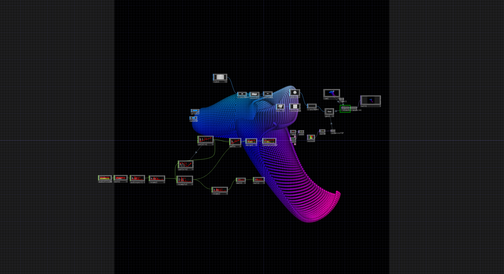

<strong>Elaborati esame Linguaggi Multimediali D.Riboli AABB 2020/21</strong>  

TD-Network_Tutorial_01  Title: Particle Displacement  Created by: bileam tschepe
https://www.youtube.com/watch?v=hbZjgHSCAPI&amp;ab_channel=bileamtschepe</string> 
Download link (my tutorial version) ->[DL_tutorial_01.toe.zip](https://github.com/daniele-ph/Elaborato.esame.daniele.lisi/files/6077889/DL_tutorial_01.toe.zip)
  
 

TD-Network_tutorial_02  Title: Pow to make landscape in Touchdesigner  Created by: Noto The Talking Ball
https://www.youtube.com/watch?v=Kxng628ejFY&ab_channel=NotoTheTalkingBall 
Download link (my tutorial version) -> [Dl_tutorial_02.toe.zip](https://github.com/daniele-ph/Elaborato.esame.daniele.lisi/files/6077874/Dl_tutorial_02.toe.zip)
  
  

TD-Network_tutorial_03 
Title: 16 – Instancing – TouchDesigner Beginner Course 
Created by: bileam tschepe https://www.youtube.com/watch?v=rYet0SwTYa0&ab_channel=bileamtschepe 
Download link (my tutorial version) -> [Dl_tutorial_04.toe.zip](https://github.com/daniele-ph/AABB.Urbino.daniele.lisi/files/6155926/Dl_tutorial_03.toe.zip)
  

  

TD-Network_tutorial_04 
Title: Infinite Looping Torus 
Created by: Noto The Talking Ball https://www.youtube.com/watch?v=lg6hNhQOtIA&ab_channel=NotoTheTalkingBall 
  
  

